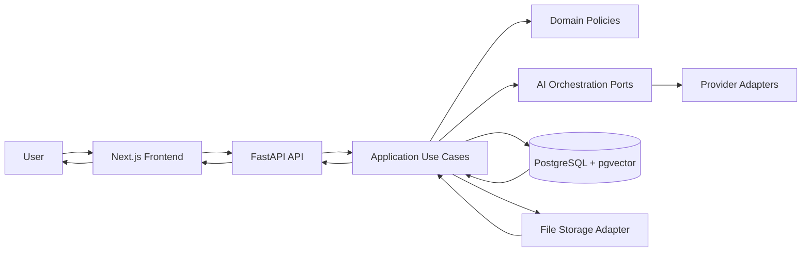
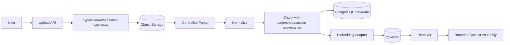

# Data Flow

## Main Flow

```mermaid
flowchart LR
  U[User] --> F[Next.js Frontend]
  F --> A[FastAPI API]
  A --> APP[Application Use Cases]
  APP --> D[Domain Policies]
  APP --> AI[AI Orchestration Ports]
  AI --> P[Provider Adapters]
  APP --> DB[(PostgreSQL + pgvector)]
  APP --> S[File Storage Adapter]
  DB --> APP
  S --> APP
  APP --> A --> F --> U
```

## Document Flow

```mermaid
flowchart LR
  U[User] --> UP[Upload API]
  UP --> V[Type/size/authorization validation]
  V --> S[(Object Storage)]
  S --> PARSE[Controlled Parser]
  PARSE --> N[Normalize]
  N --> C[Chunk with page/sheet/section provenance]
  C --> DB[(PostgreSQL metadata)]
  C --> EMB[Embedding Adapter]
  EMB --> VECTOR[(pgvector)]
  VECTOR --> RET[Retriever]
  RET --> CTX[Bounded Context Assembly]
```

Uploaded content is never treated as instructions. It enters the context pipeline as untrusted, provenance-linked data.
