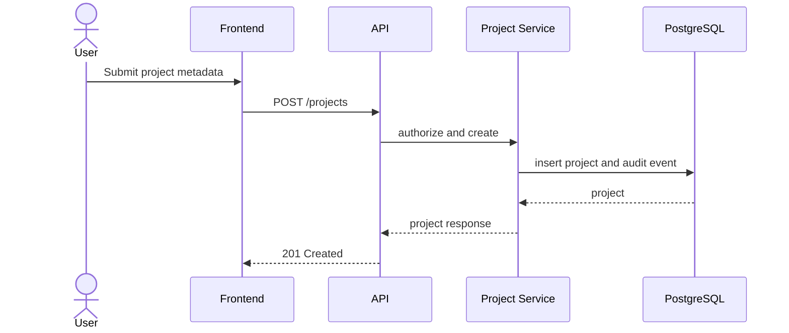
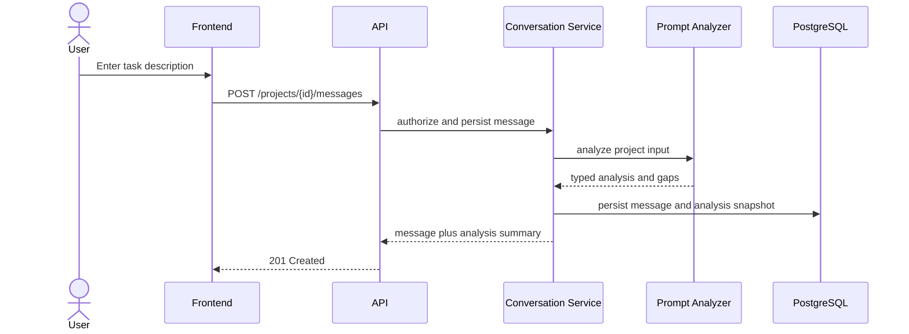
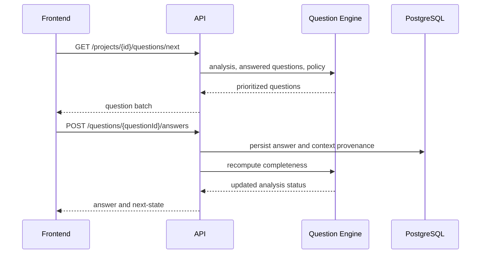
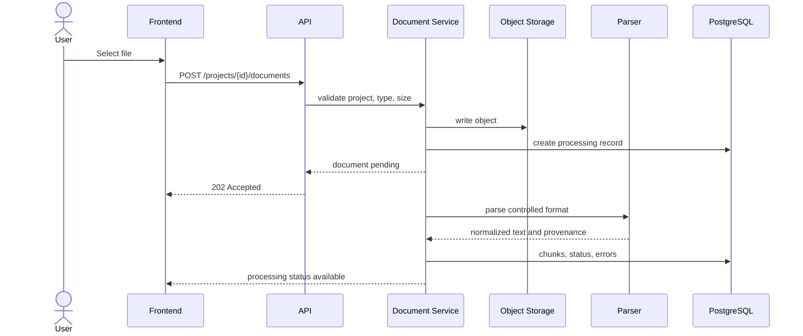
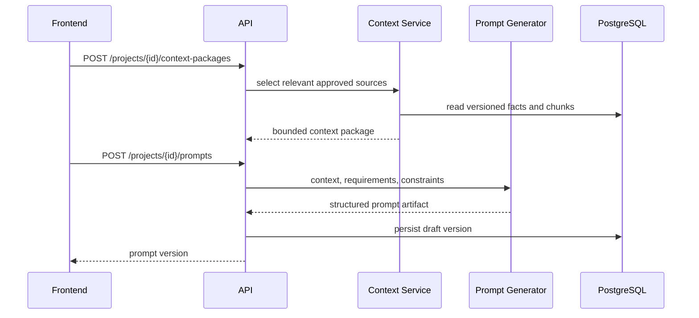
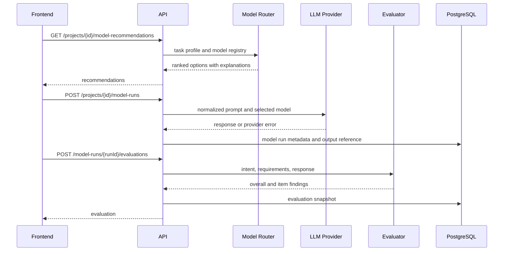

# Sequence Diagrams

## Create Project

## Submit and Analyze Prompt

## Generate Questions and Accept Answer

## Upload and Process Document

## Assemble Context and Generate Prompt

## Recommend, Run, and Evaluate

